# 常见深度学习框架对比
2018年9月21日更新：我改进了一些测度的方法。  
## 1.目前存在的框架  
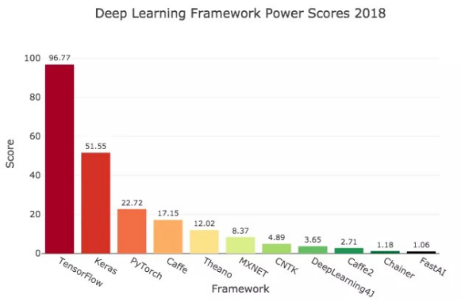   
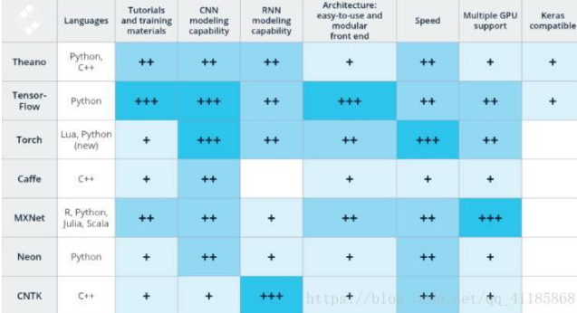  
* TensorFlow  
TensorFlow是毫无争议的赢家。GitHub上最热，谷歌搜索最多，Medium文章、亚马逊书籍、ArXiv论文最多。使用TensorFlow的开发者最多，大多数网上招聘的工作描述中也提到了它。TensorFlow背后站着Google。  
* Keras  
Keras拥有“为人类而不是机器设计的API”。几乎各项评估中，它都是第二流行的框架。Keras以TensorFlow、Theano或CNTK为底层引擎。如果你是深度学习的新手，建议从Keras开始。  
* PyTorch  
总体而言，PyTorch是第三流行的框架，也是第二流行的独立框架。它比TensorFlow要年轻，流行度的增速十分迅猛。它也支持TensorFlow尚不支持的一些定制。PyTorch背后站着的是Facebook。
* Caffe  
Caffe是第四流行的框架。它差不多快5岁了。相对而言，某些雇主还要求熟悉Caffe，一些学术论文也还用Caffe，但最近使用Caffe的人不多。  
* Theano  
Theano是蒙特利尔大学2007年研发的，也是最古老的有显著影响力的Python深度学习框架。它的流行度降了一大截，主要开发者也宣布不会再发布加入新功能的大版本了。不过，目前仍有一些更新。Theano仍然是排名第五的框架。  
* MxNet  
亚马逊使用Apache孵化的MXNET。它是第六流行的深度学习库。  
* CNTK  
CNTK是微软的认知工具集。它让我想起了微软其他很多产品，试图和谷歌、Facebook提供的工具竞争，但没赢得多少使用。  
* DL4j  
Deeplearning4J，也称为DL4J，配套Java语言使用。它是唯一不提供Python接口的准流行框架。不过，你可以导入用Keras写的模型。这也是唯一一个两个不同的搜索项(Deeplearning4J和DL4J)偶尔返回不同结果的框架。我在每项测度中使用了较高的数字。由于这个框架的评分相当低，因此这并没有带来什么实质性的改变。  
* caffe2  
Caffe2是另一个Facebook开源产品。它基于Caffe构建，现在是PyTorch项目的一部分(同一GitHub仓库)。由于现在Caffe2没有自己的代码仓库，我使用了旧仓库的GitHub数据。  
* Chainer  
Chainer是由日本公司Preferred Networks开发的框架。它有一小批使用者。  
* Fast.ai  
FastAI基于PyTorch构建。它的API借鉴了Keras，只需很少的代码(比Keras还要少)就可以得到强力的结果。目前而言，FastAI属于前沿框架，目前正处于为预计2018年10月发布的1.0版本重写代码的阶段。FastAI的作者Jeremy Howard是Kaggle的主席。他曾经写过一篇Introducing Pytorch for fast.ai，讨论为何FastAI从使用Keras转向创建自己的框架。  

## 2.标准
我选择了以下7个类别来评估深度学习框架的流行度和关注度。
### (1) 在线招聘描述 
现在的工作市场上哪种深度学习库需求更高?我搜集了LinkedIn、Indeed、Simply Hired、Monster、Angel List的上的数据。  
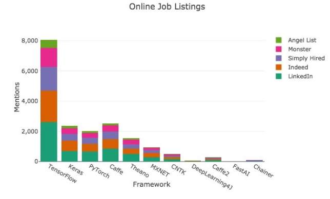  
毫无疑问，TensorFlow是这方面的赢家。如果你想找一份深度学习的工作，可以学一下TensorFlow。  
我通过“machine learning”(机器学习)加库名的方式搜索。比如，“machine learning TensorFlow”。我测试了若干搜索方法，这个方法可以得到相关性最高的结果。  
之所以额外加上一个搜索词，是因为有些框架的名字可能有歧义，比如Caffe可能有多种含义。  
### (2)使用量/KDnuggets使用调研
KDnuggets是一个流行的数据科学网站。它在调研软件使用情况的时候提问你在过去12个月的真实项目上用了什么分析、大数据、数据科学、机器学习软件?  
让人有点意外的是，Keras的使用量很高——差不多快赶上TensorFlow了。有意思，美国的雇主们热衷找具备TensorFlow技术的人，而Keras的使用率差不多一样高。  
KDnuggets有好几年的数据。尽管我在分析中只使用了2018年的数据，我需要指出，2017年后，Caffe、Theano、MXNET、CNTK的使用量下降了。  
### (3) 谷歌搜索量
最大搜索引擎上的网络搜索量是一项很好的评估流行度的指标。我查看了过去一年谷歌趋势的搜索历史。谷歌没有提供搜索量的绝对值，不过它提供了不同搜索项的对比图形。  
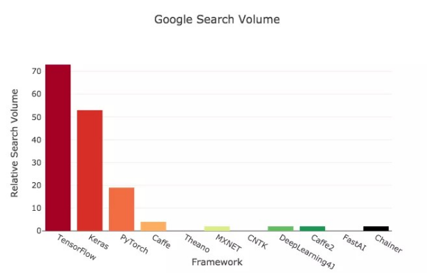  
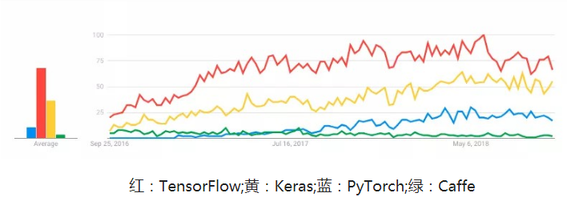  

### (4)Medium文章
Medium上有很多流行的数据科学文章和指南  
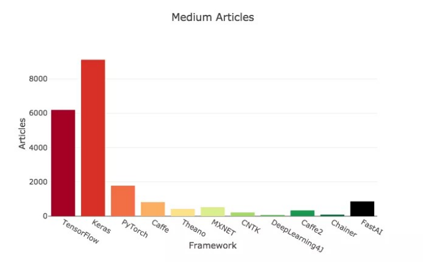  

### (5) 亚马逊数据
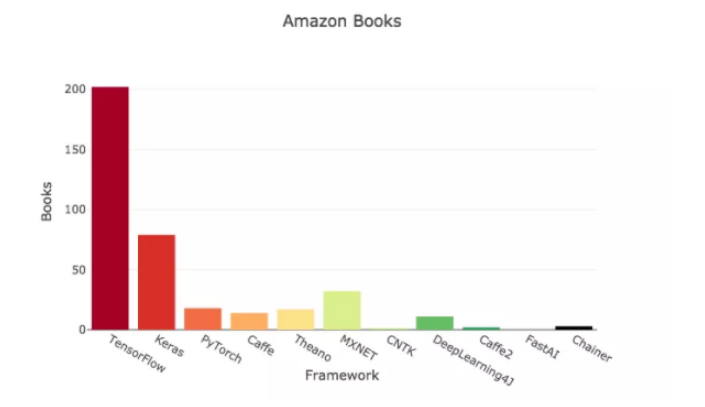    
### (6) ArXiv论文
机器学习方面的学术论文，最常发表在ArXiv上。我同样使用谷歌站内搜索，限定时间为12个月内。  
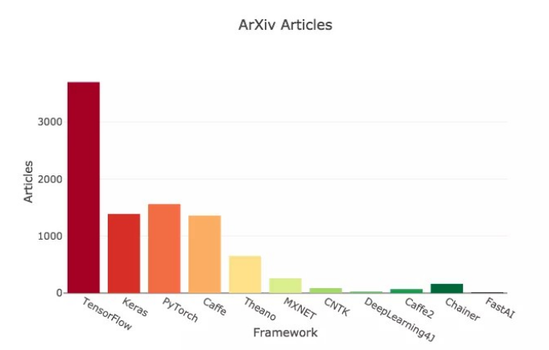  
### (7) GitHub热度  
GitHub热度是另一项框架流行度的指标。我为收藏、分叉、关注、贡献者分别制作了图表，因为这些数据更适合分别呈现，而不是混在一起。  
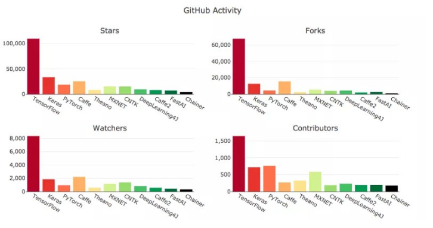  
TensorFlow也是最流行的，有大量活跃用户。考虑到FastAI甚至还不满一岁，它在GitHub上的热度相当不错。有意思的是，相比另外三个测度，不同框架的贡献者数量总体而言比较接近。   
### (8) 整体测评  
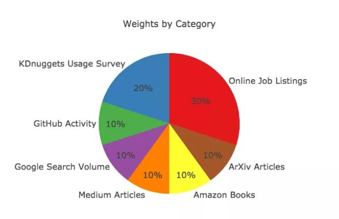  
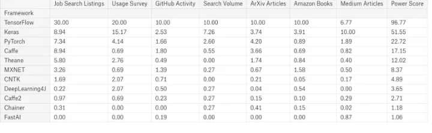  
这就得到了文章开头的图表：  
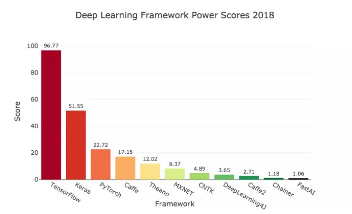  
## 3.未来  
目前为止，TensorFlow的领先地位难以动摇。短期内，它应该会继续统治深度学习领域。不过，考虑到深度学习世界的飞速变革，长期来看，TensorFlow的领先可能发生变化。  

时间会告诉我们，PyTorch是否能超越TensorFlow，就像React超越Angular一样。这两对框架还挺适合类比的。PyTorch和React都是由Facebook支撑的灵活度很高的框架，通常认为要比谷歌支撑的竞争者更容易使用。  

FastAI能获取课程之外的用户吗?它有一大堆自带的学生用户，比Keras对初学者更友好的API。  
## 4.建议
如果你掌握了Python、numpy、pandas、sklearn、matplotlib技能，考虑学习一个深度学习框架，我建议你从Keras开始。它的用户数量很大，也受到雇主的认可，Medium上也有很多文章可以参考，API也很容易使用。  

如果你已经掌握了Keras，决定下一个要学习的框架不太容易。我建议你选择TensorFlow或者PyTorch，深入学习，以做出很棒的深度学习模型。  

如果你想要熟练掌握需求量最大的框架，你应该选择TensorFlow。但研究人员很喜欢用PyTorch，因为它既易用又灵活。Quora上有一个关于选TensorFlow还是PyTorch的问题：https://www.quora.com/Should-I-go-for-TensorFlow-or-PyTorch  

如果你具备了这些框架的经验，我建议你留意下FastAI。如果你想学习基础和高级的深度学习技能，可以看下FastAI的免费在线课程。FastAI 1.0许诺让你可以很容易地实现最新的深度学习策略，并快速迭代。  

不管你选什么框架，我希望你现在对哪个深度学习框架需求最高，使用最多，文章最多有所了解。  